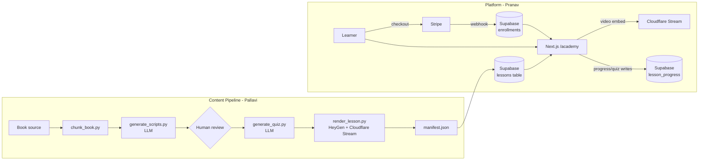

# Architecture

## System diagram

## Why this shape

The one point of coupling between the two lanes is the manifest (`docs/manifest-schema.md`) — everything upstream of it (book → script → quiz → rendered video) is pure content pipeline, and everything downstream (auth, payment, serving, progress) is pure platform. That split lets both people build and test independently against a shared contract instead of against each other's half-finished code.

## Open decisions (flag to Sundeep before locking in)

- **LLM provider** — `pipeline/config.py` and `generate_scripts.py`/`generate_quiz.py` currently assume Anthropic's API. Swap is mechanical if a different provider is preferred.
- **Mount point** — is `apps/web` its own deployment (subdomain) or does it get mounted at `quantumreadyea.org/academy` on the existing site's infra? `next.config.mjs` has a TODO for `basePath` once this is decided; it changes the deploy story materially.
- **RAG assistant timing** — schema (`book_chunks` table) is already in the initial migration so it doesn't require a breaking schema change later, but no pipeline code exists yet for it — it's explicitly a post-launch stretch task (see `docs/engineering-tasks.md`).
